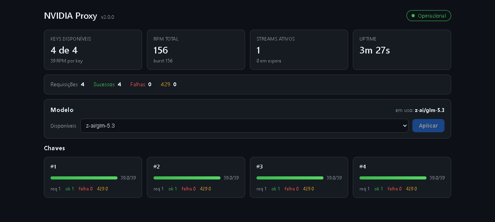

# NVIDIA NIM → Hermes Proxy

Proxy local **OpenAI-compatível** para a API NVIDIA NIM, com pool de API keys, rate limit por key, failover automático e dashboard web integrado. Feito para rodar na sua máquina e servir como backend de clientes OpenAI-compatíveis (como o Hermes Agent) sem tocar em limites de quota.

```
Cliente (Hermes, SDK OpenAI, curl...) ──> Proxy (localhost:5000) ──> NVIDIA NIM
                                         ├── pool de API keys com failover
                                         └── dashboard web integrado
```

---

## O que este programa resolve

### 1. Pool de API keys com failover automático
Várias keys da NVIDIA (até 10) num pool round-robin. Se uma key recebe 429, 5xx, 401/403 ou timeout, o proxy esfria a key e tenta a próxima **na mesma requisição** — o cliente nem percebe.
- **429**: honra o header `Retry-After` do upstream (com teto de 60s)
- **401/403**: key provavelmente revogada — cooldown de 1h
- **5xx / timeout**: cooldown de 5s e failover
- Orçamento de espera global por request (10s, configurável): se nenhuma key servir a tempo, responde 429 imediato com `Retry-After` — sem deixar o cliente pendurado

### 2. Rate limit que previne 429 em vez de só reagir
Token bucket por key (39 RPM, configurável): cada key só é usada na velocidade que a NVIDIA aceita. Com 4 keys, ~156 requisições/minuto sustentados.

### 3. Contrato OpenAI respeitado
- **Erros no formato OpenAI** (`{"error": {message, type, code}}`) — SDKs parseiam corretamente
- **`GET /v1/models` coerente**: lista só o que o proxy realmente serve (não o catálogo inteiro da NVIDIA)
- **Model override**: todo completion usa o modelo selecionado, independentemente do que o cliente pediu — troque de modelo sem reconfigurar nada no cliente
- **Streaming SSE transparente** com proteção contra o bug de `Content-Encoding` (corpo descomprimido × header gzip) e headers hop-by-hop filtrados (RFC 9110)
- **`POST /v1/completions` (legacy)**: tradução de protocolo — o NVIDIA NIM não expõe o endpoint nativo, o proxy converte para chat/completions no upstream e devolve `choices[0].text` no formato que clientes legacy esperam (mesmo pool, failover e token bucket; `stream` não suportado nesta rota)

### 4. Dashboard web integrado (React)
Abra `http://127.0.0.1:5000/` no navegador:



- **Status geral**: Operacional / Degradado / Offline
- **Keys**: "X de Y" disponíveis, barra de tokens por key, cooldown com contagem regressiva, último erro e estatísticas (req/ok/falha/429) por key
- **Modelo**: qual está em uso, lista de disponíveis e **troca em runtime** — sem restart
- **Uptime**, RPM total, streams ativos, requisições em espera, totais agregados
- Atualiza a cada 4s (pausa em aba oculta); funciona offline (banner com retry)

> **Nota para desenvolvimento do dashboard**: o dev server do Vite escuta apenas em `localhost` (IPv6) — use `http://localhost:5173`, não `http://127.0.0.1:5173`.

### 5. Observabilidade
- Log com **request-id** (`X-Request-Id`) que rastreia uma requisição através de todas as tentativas de failover — devolvido ao cliente no response
- `/health` com tudo: status degraded quando nenhuma key está disponível, uptime, last_error por key, contadores globais
- Falhas mid-stream não são silenciosas: contabilizadas, key punida, evento de erro SSE emitido

### 6. Segurança local
- Bind **só no 127.0.0.1** — nada exposto na rede (no Docker, `ports: "127.0.0.1:..."`)
- As keys do pool **nunca vazam**: Authorization do cliente descartada, substituída pela key do pool; keys nunca aparecem em log ou `/health` (só índice `#N`)
- `.env` fora do git e fora da imagem Docker (segredos entram só em runtime)
- Path traversal rejeitado; meta-headers (`X-Forwarded-*`) não repassados à NVIDIA

---

## Requisitos

| Modo | O que precisa |
|---|---|
| **Docker** (recomendado) | Docker Desktop (ou equivalente com compose v2) — nada mais |
| **Host direto** | Python 3.10+ |

Em ambos os casos você precisa de **ao menos uma API key da NVIDIA NIM** (gratuita em https://build.nvidia.com → "Get API Key") — a configuração é feita no `.env`, mostrada no passo 2 abaixo.

Modelos disponíveis: `moonshotai/kimi-k3`, `z-ai/glm-5.3`, `nvidia/nemotron-3-super-120b-a12b`, `nvidia/nemotron-3.5-lightning-30b-a3b`, `deepseek-ai/deepseek-v4.1-flash`, `z-ai/glm-5.3-flash`.

---

## Como rodar

### 1. Clone o repositório

```bash
git clone https://github.com/lazarowend/nvidia-nim-proxy.git nvidia-nim-proxy
cd nvidia-nim-proxy
```

Funciona igual em Linux, macOS e Windows.

### 2. Configure suas keys da NVIDIA

Crie o `.env` a partir do template (Linux/macOS):

```bash
cp .env.example .env
```

Windows (PowerShell):

```powershell
copy .env.example .env
```

Edite o `.env` e preencha ao menos uma key (obtida em https://build.nvidia.com, em "Get API Key"):

```dotenv
NVIDIA_API_KEY_1=nvapi-xxxxxxxxxxxxxxxxxxxxxxxx
PROXY_MODEL=z-ai/glm-5.3
```

Preencher mais keys (`NVIDIA_API_KEY_2`..`10`) aumenta a vazão agregada — o proxy faz o pool delas.

### 3. Escolha como rodar

### Opção A — Docker (recomendado)

Pré-requisitos:

| SO | O que instalar |
|---|---|
| Linux | Docker Engine + plugin compose v2 (`docker-compose-plugin`) |
| macOS | Docker Desktop (ou colima/orbctl + compose v2) |
| Windows | Docker Desktop (WSL2) |

O comando é o mesmo nos três:

```bash
docker compose up -d --build
```

Sobe **um container** com proxy + dashboard juntos (build multi-stage: o React é compilado dentro da imagem; a imagem final é só Python + estáticos). Primeiro build: alguns minutos; seguintes: segundos (cache). Não é preciso ter Python ou Node na máquina — só o Docker.

| URL | O quê |
|---|---|
| http://127.0.0.1:5000/ | Dashboard |
| http://127.0.0.1:5000/v1/chat/completions | API OpenAI-compatível (chat) |
| http://127.0.0.1:5000/v1/completions | API legacy completions (`choices[0].text`) |
| http://127.0.0.1:5000/health | Health check (usado pelo compose) |
| http://127.0.0.1:5000/admin/model | Troca de modelo (GET lista, POST troca) |

Operação:

```bash
docker compose logs -f proxy        # logs em tempo real (com request-id)
docker compose ps                   # status + health
docker compose restart              # restart sem rebuild
docker compose up -d --build        # rebuild após mudar código
docker compose down                 # parar
```

Detalhes (healthcheck, logs rotativos, bind loopback, troca de porta sem conflito): [`DEPLOY.md`](DEPLOY.md).

### Opção B — Direto no host

Pré-requisito: Python 3.10+ (Linux, macOS ou Windows).

Linux / macOS:

```bash
python3 -m pip install -r requirements.txt
python3 proxy.py
```

Windows:

```powershell
pip install -r requirements.txt
python proxy.py
```

Sem `PROXY_MODEL` no `.env`, abre o **menu interativo** de seleção de modelo no terminal. Servidor: waitress quando instalada (production-ready), senão o dev server do Flask.

### Desenvolvimento do dashboard

Pré-requisito: Node 18+. O proxy precisa estar rodando na porta 5000 (o dev server encaminha `/health` e `/admin` para ele).

```bash
cd web
npm install        # primeira vez
npm run dev        # Vite em http://localhost:5173 (proxy → :5000)
npm run build      # build de produção em web/dist (servido pelo Flask)
```

---

## Apontando um cliente (ex.: Hermes Agent)

Configure o cliente OpenAI-compatível com:

```
base_url = http://127.0.0.1:5000/v1
api_key  = <qualquer valor — o proxy substitui pelo pool>
model    = <ignorado — o proxy usa o modelo selecionado nele>
```

Teste rápido:

```bash
curl http://127.0.0.1:5000/v1/chat/completions \
  -H "Content-Type: application/json" \
  -d '{"model": "qualquer", "messages": [{"role": "user", "content": "oi"}]}'
```

Cliente legacy que usa o endpoint de completions (`choices[0].text`)? Também funciona — o proxy traduz o protocolo:

```bash
curl http://127.0.0.1:5000/v1/completions \
  -H "Content-Type: application/json" \
  -d '{"prompt": "oi"}'
```

Trocar o modelo em uso (sem restart):

```bash
curl -X POST http://127.0.0.1:5000/admin/model \
  -H "Content-Type: application/json" \
  -d '{"model": "z-ai/glm-5.3-flash"}'
```

---

## Configuração (env)

| Variável | Default | Descrição |
|---|---|---|
| `NVIDIA_API_KEY_1..10` | — | Keys do pool (obrigatório ≥1) |
| `PROXY_MODEL` | — | Modelo padrão (obrigatório no Docker) |
| `PROXY_PORT` | `5000` | Porta do host (Docker) |
| `PROXY_HOST` | `127.0.0.1` | Bind do servidor (Docker força `0.0.0.0` interno) |
| `PROXY_RPM` / `PROXY_BURST` | `39` / =RPM | Rate limit por key |
| `PROXY_READ_TIMEOUT` | `120` | Timeout de leitura entre chunks (s) |
| `PROXY_WAIT_BUDGET` | `10` | Orçamento de espera por request (s) |
| `PROXY_TARGET_URL` | NVIDIA NIM | Upstream |
| `PROXY_SERVER` | `auto` | `auto` (waitress) ou `flask` (dev server) |

---

## Estrutura do projeto

```
nvidia-nim-proxy/
├── proxy.py               # API Flask (pool, failover, rate limit, admin)
├── requirements.txt       # flask, requests, python-dotenv, waitress
├── .env.example           # template de configuração (.env real é gitignored)
├── Dockerfile              # multi-stage: node compila o front → python serve
├── docker-compose.yml      # deploy local (loopback only, healthcheck)
├── .dockerignore
├── DEPLOY.md               # guia detalhado de deploy Docker
├── ANALISE.md              # auditoria técnica (4 agentes, 30 testes)
└── web/                    # dashboard React 19 + Vite
    ├── src/App.jsx         # dashboard completo (pt-BR, tema escuro)
    ├── src/styles.css      # tema escuro, CSS puro (sem framework)
    ├── vite.config.js      # dev: proxy /health e /admin → 127.0.0.1:5000
    └── dashboard-screenshot.png
```

---

## Testes

Suíte funcional (failover, rate limit, erros OpenAI, headers, admin): 30/30 passando — roda contra o Flask test client com o upstream mockado, não consome quota. Os testes mockam `requests.request` e setam as envs de teste antes do import (o módulo exige keys no env para subir).

## Histórico de qualidade

O código passou por auditoria com 4 agentes especializados (arquitetura, concorrência, segurança HTTP, produção): 1 bug crítico latente e 4 achados de severidade alta corrigidos, todos documentados em [`ANALISE.md`](ANALISE.md).
